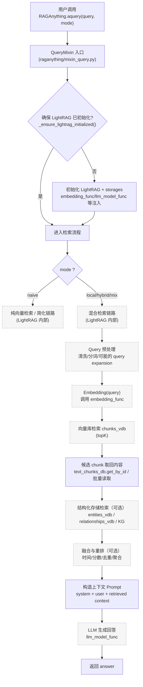
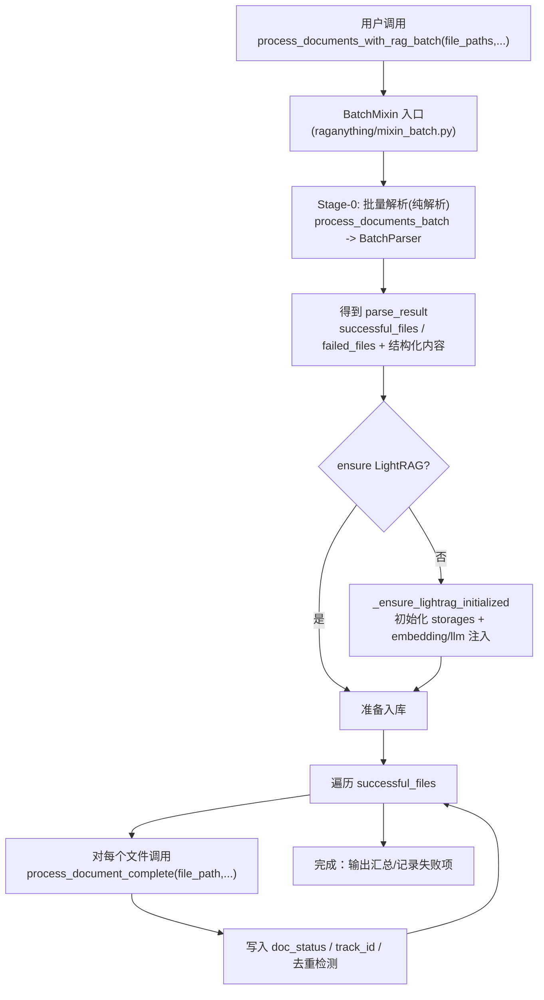
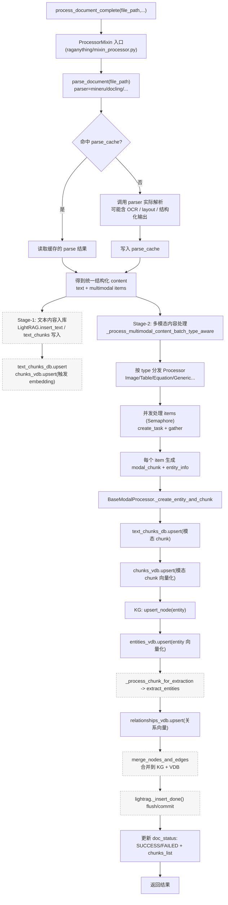

# 架构流程图（查询端 & 存储端）

本文件包含 RagAnything 项目中 **查询端（Query）** 与 **存储端（Ingest/Insert/Storage）** 的详细流程图（Mermaid）。

> 说明：`RAGAnything` 负责编排，核心检索、embedding、实体抽取与 merge 等由外部依赖 `lightrag` 提供；图中会以外部模块形式标注其输入输出与在本项目中的调用位置。

---

## 1) 查询端（Query Side）

### 1.1 纯文本查询：`rag.aquery(query, mode="hybrid")`



### 1.2 多模态增强查询：`rag.aquery_with_multimodal(query, multimodal_content=[...])`

```mermaid
flowchart TD
  Q0["用户调用\naquery_with_multimodal(query, multimodal_content)"] --> Q1["QueryMixin 入口"]
  Q1 --> Q2{确保 LightRAG 已初始化?}
  Q2 -- 否 --> Q3[初始化 LightRAG + storages]
  Q2 -- 是 --> Q4[整理 multimodal_content]

  Q3 --> Q4
  Q4 --> Q5["将 multimodal_content 规范化\ntype=table/equation/image/text..."]
  Q5 --> Q6{"是否需要 VLM/视觉模型?"}
  Q6 -- image/需要视觉理解 --> Q7["vision_model_func\n将图片/表格等转为可读文本描述"]
  Q6 -- 否 --> Q8["跳过视觉理解"]
  Q7 --> Q9["得到\"多模态描述文本\"\n作为附加上下文"]
  Q8 --> Q9

  Q9 --> Q10[拼接：query + 多模态描述 + 检索提示词]
  Q10 --> Q11["进入 LightRAG 检索链路\n(类似 aquery 的 hybrid 检索)"]
  Q11 --> Q12[LLM 生成回答]
  Q12 --> Q13[返回 answer]

  classDef ext fill:#f6f6f6,stroke:#999,stroke-dasharray: 3 3;
  class Q7,Q11,Q12 ext;
```

---

## 2) 存储端（Storage / Ingest Side）

### 2.1 批处理主入口：`process_documents_with_rag_batch(...)`



### 2.2 单文件完整入库：`process_document_complete(file_path, ...)`



---

## 3) 总览：查询端 vs 存储端共享同一套存储

```mermaid
flowchart LR
  subgraph Ingest[存储端 / 入库端]
    I1[process_documents_with_rag_batch<br/>/ process_folder_complete] --> I2[process_document_complete]
    I2 --> I3[text chunks 入库]
    I2 --> I4[multimodal chunks 入库]
    I4 --> I5[extract_entities + merge]
  end

  subgraph Storages[LightRAG Storages]
    K1[text_chunks_db (KV)]
    V1[chunks_vdb (Vector)]
    V2[entities_vdb (Vector)]
    V3[relationships_vdb (Vector)]
    G1[chunk_entity_relation_graph (KG)]
    S1[doc_status / parse_cache / llm cache]
  end

  subgraph Query[查询端 / 检索端]
    Q1[aquery / aquery_with_multimodal] --> Q2[LightRAG 检索 + 重排]
    Q2 --> Q3[LLM 生成回答]
  end

  I3 --> K1
  I3 --> V1
  I4 --> K1
  I4 --> V1
  I5 --> V2
  I5 --> V3
  I5 --> G1
  I2 --> S1

  Q2 --> K1
  Q2 --> V1
  Q2 --> V2
  Q2 --> V3
  Q2 --> G1
  Q2 --> S1
```
