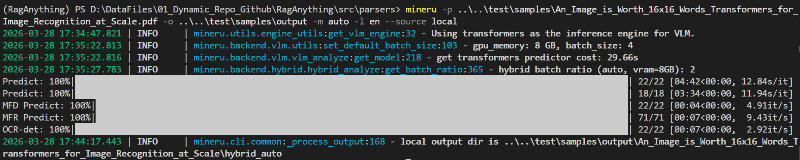
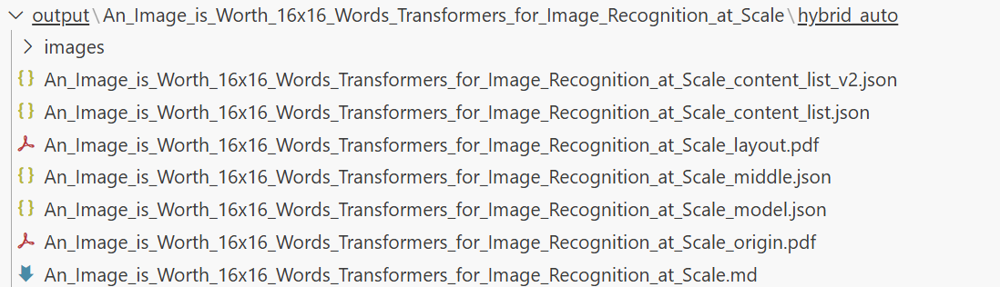

## 解析过程
下图为使用命令行进行文件解析的控制台输出：

## 解析结果

上图为最终对pdf文件的解析结果，每个输出文件说明如下：

- `images/`
    含义：MinerU 从文档中提取的图片资源（表格截图、方程图像、图示等）。
    用途：用于复现图像证据或在最终 markdown/HTML 中引用。
- `..._origin.pdf`
    含义：原始输入文件的拷贝或预处理后保留的版本（未被进一步拆分/重排）。
    用途：调试与对照，确认解析时基准文档。
- `..._layout.pdf`
    含义：可视化版 layout（通常把识别到的分段/块/box 绘制在 PDF 上）。
    用途：快速检查页面上块/行/表格识别是否准确，便于定位版式问题。
- `..._content_list.json`
    含义：一版（较原始或默认格式）的内容块列表，按检测到的块（paragraph / title / table / equation / image 等）导出，经常包含文本、bbox、页码、类型等。
    用途：详细的机器可读内容输出，适合进一步处理但可能未做最终归一化。
- `..._content_list_v2.json`
    含义：第二版/规范化后的最终内容列表（字段更稳定、结构更适合下游使用）。通常对段落/表格等做了合并、字段标准化与路径修正。
    用途（推荐用于生产）：作为下游索引、检索、QA 或生成 Markdown 的主数据源。
- `..._middle.json`
    含义：管线中间态数据（在从 origin 到 v2 的处理流中的中间结果），可能包含已合并的段落但还未完全规范化的元信息。
    用途：用于调试处理逻辑（例如段落合并、表格检测策略），不一定适合直接下游消费。

- `..._model.json`
    含义：与本次解析有关的模型/推理元信息（可能包含使用的模型名、版本、revision、参数或推理配置）。
    用途：记录可复现性信息或用于审计（确认用的是哪个模型/版本）。
- `... .md`
    含义：把解析结果渲染成 Markdown 的人类可读版（通常由 v2 内容生成）。
    用途：人工检查、笔记或直接发布/阅读。