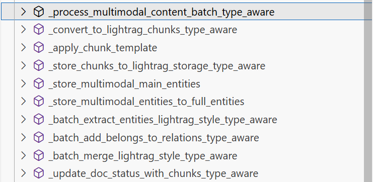

# 向量数据库与知识图谱
## 目录
- [初始化 lightrag 实例](#初始化-lightrag-实例)
- [`ProcessorMixin` 类](#processormixin-类)
    - [`self._process_multimodal_content_individual()` 函数](#self_process_multimodal_content_individual-函数)
    - [`self._process_multimodal_content_batch_type_aware()` 函数](#self_process_multimodal_content_batch_type_aware-函数)
- [LLM分析中常见的报错](#llm分析中常见的报错)
    - [警告1](#警告1)
    - [警告2](#警告2)
    - [警告3](#警告3)
    - [警告4](#警告4)
- [数据库构建结果](#数据库构建结果)
    - [kv 数据库](#kv-数据库)
    - [向量数据库](#向量数据库)

## 初始化 lightrag 实例

首先引入一个大语言模型处理函数，如下：
```python
def get_llm_model_func(api_key: str, base_url: str = None, llm_model: str = "gpt-4o-mini"):
    return (
        lambda prompt,
        system_prompt=None,
        history_messages=[],
        **kwargs: openai_complete_if_cache(
            llm_model,
            prompt,
            system_prompt=system_prompt,
            history_messages=history_messages,
            api_key=api_key,
            base_url=base_url,
            **kwargs,
        )
    )
```

接着引入一个用于图像处理的大模型函数，如下：
```python
def get_vision_model_func(api_key: str, base_url: str = None, vlm_model: str = "gpt-4o"):
    return (
        lambda prompt,
        system_prompt=None,
        history_messages=[],
        image_data=None,
        **kwargs: openai_complete_if_cache(
            vlm_model,
            "",
            system_prompt=None,
            history_messages=[],
            messages=[
                {"role": "system", "content": system_prompt} if system_prompt else None,
                {
                    "role": "user",
                    "content": [
                        {"type": "text", "text": prompt},
                        {
                            "type": "image_url",
                            "image_url": {
                                "url": f"data:image/jpeg;base64,{image_data}"
                            },
                        },
                    ],
                }
                if image_data
                else {"role": "user", "content": prompt},
            ],
            api_key=api_key,
            base_url=base_url,
            **kwargs,
        )
        if image_data
        else openai_complete_if_cache(
            "gpt-4o-mini",
            prompt,
            system_prompt=system_prompt,
            history_messages=history_messages,
            api_key=api_key,
            base_url=base_url,
            **kwargs,
        )
    )
```

```python
async def initialize_rag(api_key: str, base_url: str = None):
    # Use environment variables for embedding configuration
    import os

    embedding_dim = int(os.getenv("EMBEDDING_DIM", "3072"))
    embedding_model = os.getenv("EMBEDDING_MODEL", "text-embedding-3-large")

    rag = LightRAG(
        working_dir=WORKING_DIR,
        embedding_func=EmbeddingFunc(
            embedding_dim=embedding_dim,
            max_token_size=8192,
            func=lambda texts: openai_embed(
                texts,
                model=embedding_model,
                api_key=api_key,
                base_url=base_url,
            ),
        ),
        llm_model_func=lambda prompt,
        system_prompt=None,
        history_messages=[],
        **kwargs: openai_complete_if_cache(
            "gpt-4o-mini",
            prompt,
            system_prompt=system_prompt,
            history_messages=history_messages,
            api_key=api_key,
            base_url=base_url,
            **kwargs,
        ),
    )

    await rag.initialize_storages()
    await initialize_pipeline_status()

    return rag
```

## `ProcessorMixin` 类 
该类的主要完成内容如下：
- 该类完整地把一个文件（或已有的 content_list）处理成可检索的 RAG 内容并写入下游存储。
- 把解析、文本插入、多模态处理、状态更新整合为一条流水线。

该类的结构如下：
```
└── class ProcessorMixin
    |   # 相关唯一 id 生成方式
    ├── _get_file_reference(...)
    ├── _generate_cache_key(...)
    ├── _generate_content_based_doc_id(...)	
    ├── _get_cached_result(...)
    ├── _store_cached_result(...)
    |   
    |   # 文件解析
    ├── parse_document(...)
    |   
    |   # 多模态内容处理 
    ├── _process_multimodal_content(...)
    ├── _process_multimodal_content_individual(...)
    ├── _process_multimodal_content_batch_type_aware(...)
    ├── _convert_to_lightrag_chunks_type_aware(...)
    ├── _apply_chunk_template(...)
    ├── _store_chunks_to_lightrag_storage_type_aware(...)
    ├── _store_multimodal_main_entities(...)
    ├── _store_multimodal_entities_to_full_entities(...)
    ├── _batch_extract_entities_lightrag_style_type_aware(...)
    ├── _batch_add_belongs_to_relations_type_aware(...)
    ├── _batch_merge_lightrag_style_type_aware(...)
    ├── _update_doc_status_with_chunks_type_aware(...)
    | 
    |   # 解析状态函数
    ├── _mark_multimodal_processing_complete(...)
    ├── is_document_fully_processed(...)
    ├── get_document_processing_status(...)
    |
    |   # 全流水线包装函数
    ├── process_document_complete(...)
    ├── process_document_complete_lightrag_api(...)
    |
    └── insert_content_list(...)
```
### `self._process_multimodal_content_individual()` 函数

### `self._process_multimodal_content_batch_type_aware()` 函数
该函数可以根据 multimodal_items 类别的不同并发的进行处理和存储：
- **阶段 1**
    定义函数 `def process_single_item_with_correct_processor(...)`
- **阶段 2：转换为 LightRAG chunks format**
    调用函数 `self._convert_to_lightrag_chunks_type_aware(...)`
- **阶段 3：将 chunks 存储到 LightRAG 的存储中**
    调用函数 `self._store_chunks_to_lightrag_storage_type_aware(...)`
- **阶段 3.5：将多模态**
    调用函数 `self._store_multimodal_main_entities(...)`
- **阶段 4**
    调用函数 `self._batch_extract_entities_lightrag_style_type_aware(...)`
- **阶段 5**
    调用函数 `self._batch_add_belongs_to_relations_type_aware(...)`
- **阶段 6**
    调用函数 `self._batch_merge_lightrag_style_type_aware(...)`
- **阶段 7**
    调用函数 `self._update_doc_status_with_chunks_type_aware(...)`



该部分相关函数如上，都是为了辅助 `_process_multimodal_content_batch_type_aware` 函数而创建的，在快速阅读的时候可以直接跳过，同样在测试的时候也可以直接测试主函数 `_process_multimodal_content_batch_type_aware()`

## LLM分析中常见的报错

### 警告1
```cmd
WARNING: chunk-3f2b2edddbcbb64bc39c56f1e5b23541: LLM output format error; found 4/5 
fields on RELATION `Input Image`~`Content`
```
这个警告表明 LLM 在提取关系（RELATION）时，输出格式不完整，期望5个字段但只得到了4个。

### 警告2
```cmd
WARNING: chunk-26453dfefc4be91282bf4a0088918ba7: Complete delimiter can not be found 
in extraction result
```
这个警告表明在提取结果中找不到完整的分隔符，这通常发生在文本块的结构不符合预期格式时。


### 警告3
```cmd
WARNING: chunk-fe18ddec03349a6128ad25d7c94b15ea: LLM output format error; 
find LLM use <|#|> as record separators instead new-line
```
LLM 使用了 <|#|> 作为记录分隔符，而不是预期的换行符

### 警告4
```cmd
WARNING: chunk-8369a6f13045993953d9318f22d62499: LLM output format error; found 6/5 fields
on RELATION `Szegedy, C.`~`Liu, W.`
```
这个警告表明 LLM 输出了超过预期数量的字段（6个字段而不是5个）

## 数据库构建结果
最终通过调用lightrag产生的数据库结构如下：
```
└── ../
    ├── graph_chunk_entity_relation.graphml
    |	# 知识图谱存储
    ├── kv_store_full_entities.json
    |	# kv数据库，存储各个文件中的实体信息
    ├── kv_store_full_relations.json	
    |	# kv数据库，存储各个文件中的关系信息
    ├── kv_store_llm_response_cache.json
    |	# kv数据库，存储llm响应缓存
    ├── kv_store_text_chunks.json
    |	# kv数据库，存储各个文件的text划分好的chunks
    ├── vdb_chunks.json
    |	# 向量数据库
    ├── vdb_entities.json
    |	# 向量数据库
    └── vdb_relationships.json
    	# 向量数据库
```
### kv 数据库
各个 json 文件内容如下：
```json
// kv_store_full_entities.json
{
    "doc-id": {
        "entity_names": [
            "entity_name_1",
            // ...
        ],
        "count": 255,
        "create_time": 1774843868,
        "update_time": 1774843868,
        "_id": "doc-id"
    }
}
```

```json
// kv_store_full_relations.json
{
    "doc-id": {
        "relation_pairs": [
            [
                "entity_1",
                "entity_2"
            ],
            // ...
        ],
        "count": 1500,
        "create_time": 1774843868,
        "update_time": 1774843868,
        "_id": "doc-id"
    }
}
```

```json
// kv_store_llm_response_cache.json
{
    "default:extarct:050e66b413a35a8082a8e4c2df18ef40": {
        "return": "",
        "cache_type": "",
        "chunk_id": "",
        "original_prompt": "",
        "queryparam": "",
        "create_time": 0,
        "update_time": 0,
        "id": "default:extarct:050e66b413a35a8082a8e4c2df18ef40"
    },
    //...
}
```

```json
// kv_store_text_chunks.json
{
    "chunk-fb5e57b527c171b9ec84888e272ae32b": {
        "tokens": 242,
        "content": "",
        "chunk_order_index": 0,
        "full_doc_id": "",
        "file_path": "",
        "llm_cache_list": [],
        "create_time": 0,
        "update_time": 0,
        "id": "chunk-fb5e57b527c171b9ec84888e272ae32b"
    },
    //...
}
```

### 向量数据库
```json
// vdb_chunks.json
{
    "embedding_dim": 1536,
    "data": [
        {
            "__id__": "chunk-xxxx",
            "__created_at__": 1774840538,
            "content": "...",
            "full_doc_id": "chunk-xxxx",
            "file_path": "xxx.pdf",
            "vector": "xxxx",
        },
        // ...
    ],
    "matrix": "xoxo"
}
```
介绍如下：
- `embedding_dim`：向量的尺寸
- `data`: 存储的数据。
    - `__id__`: 为当前对象唯一的 id 编号，对于 chunk 对象，以 chunk- 开头。
    - `__create_at__`：当前对象创建时的时间戳。
    - `content`:
    - `full_doc_id`: chunk 对象的 id 编号，与 `__id__` 保持一致。
    - `file_path`: chunk 对象来源的文件。
    - `vector` : chunk 对象的向量表示（Base64 编码），用于相似度检索


```json
// vdb_entities.json
    "embedding_dim": 1536,
    "data": [
        {
            "__id__": "ent-xxxx",
            "__created_at__": 1774840537,
            "entity_name": "entity_name(CONTENT_TYPE)",
            "content": "",
            "source_id": "chunk-xxxx",
            "file_path": "xxx.pdf",
            "vector": "xxxx"
        },
        // ...
    ],
    "matrix": "xoxo"
```
介绍如下：
- `embedding_dim`：向量的尺寸
- `data`: 存储的数据。
    - `__id__`: 为当前对象唯一的 id 编号，对于 entity 对象，以 ent- 开头。
    - `__create_at__`：当前对象创建时的时间戳。
    - `entity_name`: 根据 llm 生成的实体对象的名称，后面跟着对象所属 chunk 的类型。
    - `content`:
    - `source_id`: entity 对象所属 chunk 的 id 编号。
    - `file_path`: entity 对象来源的文件。
    - `vector` : entity 对象的向量表示（Base64 编码），用于相似度检索


```json
// vdb_relationships.json
    "embedding_dim": 1536,
    "data": [
        {
            "__id__": "rel-xxxx",
            "__created_at__": 1774840537,
            "src_id": "src_entity_name",
            "tgt_id": "tgt_entity_name",
            "source_id": "src_entity's chunk-xxxx",
            "content": "",
            "file_path": "xxx.pdf",
            "vector": "xxxx",
        },
        // ...
    ],
    "matrix": "xoxo"
```
介绍如下：
- `embedding_dim`：向量的尺寸
- `data`: 存储的数据。
    - `__id__`: 为当前对象唯一的 id 编号，对于 relation 对象，以 rel- 开头。
    - `__create_at__`：当前对象创建时的时间戳。
    - `src_id`: 源头 entity 对象的名称
    - `tgt_id`: 目标 entity 对象的名称
    - `content`: 
    - `file_path`: relation 对象来源的文件。
    - `source_id`: relation 对象的源头 entity 的 id 编号。
    - `file_path`: relation 对象来源的文件。
    - `vector` : relation 对象的向量表示（Base64 编码），用于相似度检索